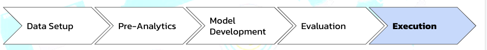

# Customer Churn Prediction

# Application to Customer Churn

The notebooks in this repository document a step-by-step application of the framework to a real-world use case and dataset - predicting
customer churn. This is a critical need for subscription-based businesses and an ideal application of machine learning. 

# Process
 

# Framework Steps

1. __Prediction engineering__
  * State business need
  * Translate business requirement into machine learning task by specifying problem parameters
  * Develop set of labels along with cutoff times for supervised machine learning
2. __Feature Engineering__
  * Create features - predictor variables - out of raw data 
  * Use cutoff times to make valid features for each label
  * Apply automated feature engineering to automatically make hundreds of relevant, valid features 
3. __Modeling__
  * Train a machine learning model to predict labels from features
  * Use a pre-built solution with common libraries
  * Optimize model in line with business objectives

# Results

The final results of our model are shown below:

| ROC AUC | Sensitivity | Specificity | F1 Score |
|---------|--------|-----------|----------|
| 0.83     | 82%  | 89%%     | 0.89   |

Kaggle Link - https://www.kaggle.com/harmanbhutani/eda-bankprediction?scriptVersionId=23584175

My Presentation Link - https://docs.google.com/presentation/d/1L-ubLUQKIO7bp4FpdiqM0bPxty6WokvO-p691loXjC4/edit?usp=sharing

